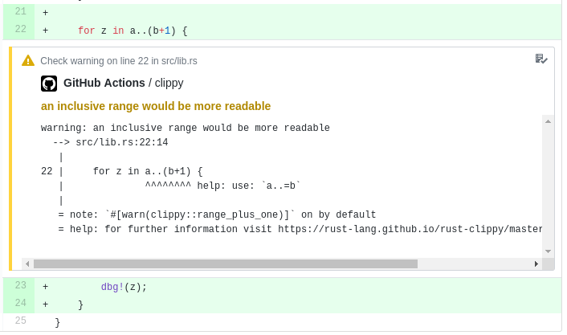

# Rust `clippy-check` Action


[](https://gitter.im/actions-rs/community)

> Clippy lints in your Pull Requests

This GitHub Action executes [`clippy`](https://github.com/rust-lang/rust-clippy)
and posts all lints as annotations for the pushed commit, as in the live example [here](https://github.com/actions-rs/example/pull/2/files).



## Example workflow

This example is utilizing [`components-nightly`](https://github.com/actions-rs/components-nightly)
and [`toolchain`](https://github.com/actions-rs/toolchain) Actions
to install the most recent `nightly` clippy version.

```yaml
on: push
name: Clippy check
jobs:
  clippy_check:
    runs-on: ubuntu-latest
    steps:
      - uses: actions/checkout@v1
      - id: component
        uses: actions-rs/components-nightly@v1
        with:
          component: clippy
      - uses: actions-rs/toolchain@v1
        with:
            toolchain: ${{ steps.component.outputs.toolchain }}
            override: true
      - run: rustup component add clippy
      - uses: actions-rs/clippy-check@v1
        with:
          token: ${{ secrets.GITHUB_TOKEN }}
          args: --all-features
```

### With stable clippy

```yaml
on: push
name: Clippy check
jobs:
  clippy_check:
    runs-on: ubuntu-latest
    steps:
      - uses: actions/checkout@v1
      - run: rustup component add clippy
      - uses: actions-rs/clippy-check@v1
        with:
          token: ${{ secrets.GITHUB_TOKEN }}
          args: --all-features
```

## Inputs

* `token` (*required*): GitHub secret token
* `toolchain` - Rust toolchain to use (without the `+` sign, ex. `nightly`);\
    Override or system default toolchain will be used if omitted.
* `args` - Arguments for the `cargo clippy` command
* `use-cross` - Use [`cross`](https://github.com/rust-embedded/cross) instead of `cargo` (default: `false`)

For extra details about the `toolchain`, `args` and `use-cross` inputs,
see [`cargo` Action](https://github.com/actions-rs/cargo#inputs) documentation.
